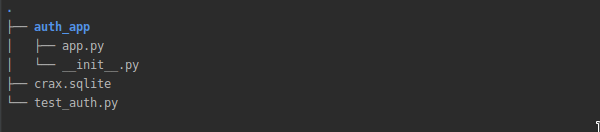
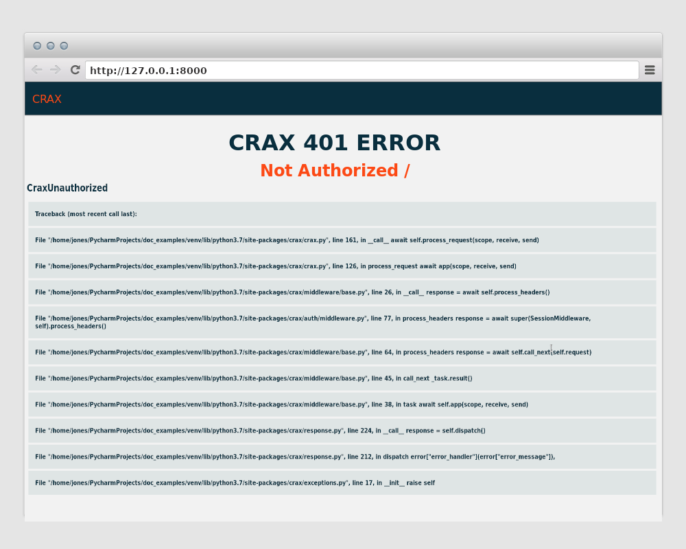

.. _authorization:

Authorization
-----------------------------------------------

By default, the authorization backend is disabled. Thus, if you are going to use Crax `Authorization`,
you must set up any available database to store the user model. See the Installation sections for details.
The authorization backend won't work without the dependencies installed.
Once you've set up your favorite database server, you must enable authorization. In your project settings, enable the
`crax.auth.middleware.AuthMiddleware` and `crax.auth.middleware.SessionMiddleware` variables in the `MIDDLEWARE`.
Then set the `SECRET_KEY` variable.

.. code-block:: python

    SECRET_KEY = "My Super Secret Key"

    MIDDLEWARE = [
        "crax.auth.middleware.AuthMiddleware",
        "crax.auth.middleware.SessionMiddleware",
    ]

You did it. Your project is now ready to work with the default Crax authorization backend.
Of course, you can customize your authorization backend. See :ref:`settings` for details.

Authorization Middleware
======================================================

Good. What you get out of the box using Crax Authorization backend.
The authorization backend has two parts. First part:

**AuthMiddleware**:

    This inherits from `RequestMiddleware`. See All About Crax Middleware under :ref:`middleware`.
    Every request your application receives will be handled by this
    middleware before it will be passed to
    Url Resolver and / or your handler. So when  you retrieve: ref: `request`
    object, it already has a User instance or AnonymousUser if the user is not authenticated.
    First of all, this middleware checks if there is a cookie value in the request headers. If it doesn't exist, `Request.user`
    will be set to `AnonymousUser`. Otherwise, this middleware will try to unsign the cookie value.
    If it will be unsigned without errors, will be processed query to the database to get user information.
    Why Crax doesn't store all information in signed session? Just because User's data can be changed but
    session data will not be changed. Thus user data will be not up to date. For example, one of the users was marked
    as a staff, than was took place some changes and this user was marked as not staff person. So you have got wrong
    privileges vulnerability.
    There is just one way: Log out user if any changes were made in account, and seems it is not good idea.
    So Crax is about to store just data that is not supposed to be changed e.g Username and Pk.
    Username is the unique field of User's model and Pk is the private key of this model.
    You should consider that session cookies are not stored in the database, so only one database query will be made.
    Ok. If Crax could get information about User from session cookie, :ref:`request` user will be set as `User`.
    If user wasn't find :ref:`request` user will be set to `AnonymousUser`.

Second part is:

**SessionMiddleware**:

    This inherits from `ResponseMiddleware`. If the first part just checks if the session cookie exists and sets
    User model for Request, so the second is for setting the session cookie. This part is like the first
    checks if the session cookie exists and is valid. A session cookie is a key and value pair in: ref: `request` cookies dict.
    The key is equal to the value of the "SESSION_COOKIE_NAME" variable in your settings (by default, this is "session_id").
    And the value is your signed cookie.
    If all conditions are right it do nothing. If session cookie is invalid e.g `Expired` or `Wrong signed`
    it sets new session cookie to the signed value of an `AnonymousUser`. Thus only response which value was changed
    will has session cookie value.
    In case if user is done with the log in procedure, will be created object of :ref:`request` session. If this object
    exists and it is not empty, Crax will try to unsign given value. If no errors was occurred, will be set new value
    "set-cookie" to the headers, otherwise will be set cookies equals to an `AnonymousUser`.

Session
======================================================

A Crax session is nothing more than a timestamped cookie. `Timestamp Signed Cookie <https://itsdangerous.palletsprojects.com/en/1.1.x/timed/>`_
with `itsdangerous.signer.HMACAlgorithm()`. It takes as a secret key value of your project settings variable
`SECRET_KEY` and as the sign value colon separated string "Username:User.pk".
**Please NOTE! Your SECRET_KEY should be stored in secure place that no one except you can get access**.
Otherwise all of authorization mechanisms will have no effect. Same thing if you will lost your SECRET_KEY all of current
sessions will be marked as invalid and your users will be logged out.

User
======================================================

Crax Default User is a generic Crax database model. See All about databases under: ref: `databases`.
Like other models can be used as a parent class of your Custom User model. And it can be expanded with any fields that you
to want. Crax does not currently support a custom model for the Default Authorization backend. But it will be soon.
The user model will be created automatically if you have activated the authorization backend. Thus, if you have activated
`Authorization backend`, and then run the commands `makemigrations` and `migrate`, the` users` table will be created in your
database.

The "Group" and "User Group" models will also be created. In case you want to divide users into groups
you can create “Group” records in your database and link them to “User” using the UserGroup model, which is nothing more
than the ManyToMany relationship for User and Group. At the moment there is no mechanism to resolve user permissions using
group policies. But it will be soon. However, there are policies for accessing views using user data. You can manage
access to your views depending on whether the user is authenticated or not, whether the user is a staff or perhaps a superuser.
Each model field is nothing more than the `SQLAlchemy Column`. See `SQLAlchemy Core <https://docs.sqlalchemy.org/en/13/core/index.html>`_
and the :ref:`databases` section for details.

**id**:
    `Column(Integer, primary_key=True)`

**username**:
    `Column(String(length=50), nullable=False)`

    `unique = UniqueConstraint("username", name="username")`

    So every username is supposed to be unique.

**password**:
    `Column(String(length=250), nullable=False)`

**first_name**:
    `Column(String(length=50))`

**middle_name**:
    `Column(String(length=50), nullable=True)`

**last_name**:
    `Column(String(length=50), nullable=True)`

**phone**:
    `Column(String(length=20), nullable=True)`

**email**:
    `Column(String(length=150), nullable=True)`

**is_active**:
    `Column(Boolean(), default=True)`

**is_staff**:
    `Column(Boolean(), default=False)`

**is_superuser**:
    `Column(Boolean(), default=False)`

**date_joined**:
    `Column(DateTime(), nullable=True)`

**last_login**:
    `Column(DateTime(), nullable=True)`

Model attributes. Besides all of the listed above fields User model has some attributes that the common python class
properties.

**is_authenticated**
    Is for check whether or not current user is authenticated. You can use it in you handlers, templates or whatever by access to
    request.user.is_authenticated

**pk**:
    Equals to the value of **id**.

**session**:
    Value of current user signed session.
    .. code-block:: python

        class AuthView(BaseView):
            methods = ["POST"]

            async def post(self):
                username = self.request.post["username"]
                password = self.request.post["password"]
                await login(self.request, username, password)
                response = JSONResponse(self.request, {"username": username, "session": self.request.user.session})
                return response

**full_name**:
    If current user's last name is not null it will be set to the string that contains username, first_name, last_name.
    Otherwise it'll be set to username, first_name

AnonymousUser
======================================================

Every not authenticated user is `AnonymousUser`. It is python class that has some attributes.

**is_authenticated**:
    Type of bool. Always False.

**pk**:
    Type of int. Always 0.

**username**:
    Type of str. Always "".

**is_staff**:
    Type of bool. Always False.

**is_superuser**:
    Type of bool. Always False.

**is_active**:
    Type of bool. Always False.

**session**:
    Type of NonType.

Request User
======================================================
What information about the user can you get with `request.user`

.. code-block:: python

    class MyView(BaseView):
        methods = ["GET"]

        async def get(self):
            self.request.user

**pk**:
    User's database id value.

**username**:
    User's username

**full_name**:
    User's full name. Described above

**is_active**:
    Value of is_active database field.

**is_staff**:
    Value of is_staff database field.

**is_superuser**:
    Value of is_superuser database field.

Authorization Utils
======================================================
Let's create a simple Crax app that uses the default authorization backend.
Assuming Crax was installed with a Sqlite database backend. So we started a project and
created a simple application named `auth_app` with the structure shown below.

So, if you've read the previous chapters, you know how to create Crax apps. We're going to create python
a package named `auth_app` and create one python file inside named` app.py`.

.. code-block:: python

    #app.py
    import json
    import os
    import sys

    from crax.auth import create_user, login
    from crax.auth.authentication import logout
    from crax.response_types import JSONResponse
    from crax.urls import Url, Route
    from crax.views import BaseView
    from crax import Crax
    from crax.commands import from_shell

    class Home(BaseView):
        login_required = True

        # We set login_required to True. Thus authenticated users only are able to see the content
        async def get(self):
            return JSONResponse(self.request, {'username': self.request.user.username})

    class CreateUser(BaseView):
        methods = ['POST']

        # Let's create user
        async def post(self):
            data = json.loads(self.request.post)
            username = data['username']
            password = data['password']
            first_name = data['first_name']
            try:
                await create_user(username=username, password=password, first_name=first_name)
                response = JSONResponse(self.request, {'success': 'Created'})
            except Exception as e:
                response = JSONResponse(self.request, {'error': str(e)})
            return response

    class LoginView(BaseView):
        methods = ['POST']

        # As far as we have created user, we can sign this user in.
        # And we are going to test that exact user is signed in, using
        # request.user.username to check it

        async def post(self):
            data = json.loads(self.request.post)
            username = data['username']
            password = data['password']
            try:
                await login(self.request, username=username, password=password)
                response = JSONResponse(self.request, {'success': f'User {self.request.user.username} signed in'})
            except Exception as e:
                response = JSONResponse(self.request, {'error': str(e)})
            # We want to override default 201 status code for POST method cause we create nothing
            response.status_code = 200
            return response

    class LogOutView(BaseView):

        # At the next step we want to sign user out
        async def get(self):
            try:
                await logout(self.request)
                response = JSONResponse(self.request, {'success': f'User signed out', 'user': self.request.user})
            except Exception as e:
                response = JSONResponse(self.request, {'error': str(e)})
            response.status_code = 200
            return response

    BASE_URL = os.path.dirname(os.path.dirname(os.path.abspath(__file__)))

    URL_PATTERNS = [
        Route(Url('/'), Home),
        Route(Url('/create_user'), CreateUser),
        Route(Url('/login'), LoginView),
        Route(Url('/logout'), LogOutView)
    ]

    APPLICATIONS = ['auth_app']

    SECRET_KEY = "MySuperSecretKey"

    MIDDLEWARE = [
        "crax.auth.middleware.AuthMiddleware",
        "crax.auth.middleware.SessionMiddleware",
    ]

    DATABASES = {
        "default": {
            "driver": 'sqlite',
            "name": f'/{BASE_URL}/crax.sqlite',
        }
    }

    app = Crax(settings="auth_app.app", debug=True)

    # We are going to use Crax command line tools
    # So we should write some additional code

    if __name__ == "__main__":
        if sys.argv:
            from_shell(sys.argv, app.settings)

We have done. As you can see, simple Crax applications can be created using just one file.
Of course, all of the above handlers can be written as you like. Good. Now we must create our
database. We don't want to create any additional tables, so we can just run from the console:

.. code-block:: bash

    python auth_app/app.py makemigrations
    python auth_app/app.py migrate

That's all. At this point, the default users table is present in our sqlite file and we can run some simple tests. let's
create a Python file named `test_auth.py`. You can place it anywhere you like.

.. code-block:: python

    import requests

    def create_user():
        resp = requests.post(
            'http://127.0.0.1:8000/create_user',
            json={'username': 'mark', 'password': 'qwerty', 'first_name': 'Mark'}
        )
        assert resp.json() == {'success': 'Created'}
        assert resp.status_code == 201

    def login():
        session = requests.session()
        resp = session.get('http://127.0.0.1:8000/')
        assert resp.status_code == 401
        resp = session.post(
            'http://127.0.0.1:8000/login',
            json={'username': 'mark', 'password': 'qwerty'}
        )
        cookies = session.cookies
        assert resp.json() == {'success': f'User mark signed in'}
        assert resp.status_code == 200
        resp = requests.get('http://127.0.0.1:8000/', cookies=cookies)
        assert resp.status_code == 200
        resp = session.get('http://127.0.0.1:8000/logout')
        assert resp.status_code == 200
        logout_cookies = resp.cookies
        assert resp.json() == {'success': f'User signed out', 'user': None}
        resp = requests.get('http://127.0.0.1:8000/', cookies=logout_cookies)
        assert resp.status_code == 401
        resp = requests.get('http://127.0.0.1:8000/', cookies=cookies)
        assert resp.status_code == 200

    create_user()
    login()

Ok. Launch our application.

.. code-block:: bash

    uvicorn auth_app.app:app

As you can see, we have set the debug mode to True in our `app.py` file. So, if we open a browser at `http: //127.0.0.1: 8000`
We will see something like:

We set our root path to only allow authenticated users to access, so we got an error and because we were in
in debug mode, we saw such a page. For all errors see :ref:`exceptions`.

In example above we used some `Authorization backend` built functions.

**create_user**:
    Function to create default user. Takes arguments:

        **username**: Required. Type of str.

        **password**: Required. Type of str.

        **first_name**: Required. Type of str.

        **kwargs**: Optional. You can pass as known word arguments any values according to `User` model fields.

    Note that string that is given for the password value will be transformed to the password hash, using the
    **create_password** built in function.

**create_password**:
    Function to create user passwords. Takes arguments:

    **password**: Required. Type of str.

    Note that settings `SECRET_KEY` variable must be defined at your project configuration to use this function.
    Creates password hash using `Pbkdf2 Hmac <https://docs.python.org/3/library/hashlib.html#hashlib.pbkdf2_hmac>`_
    with 100 000 iterations. And settings `SECRET_KEY` variable as salt.
    Returns password hash.

**check_password**:
    Function that checks given passwords.
    **hashed**: Required. Type of str. Hashed password value.

    **password**: Required. Type of str. String representation of password.

    Returns bool compare result.

**login**:
    Simple helper that signs user in. Takes arguments:

    **request**: Required. Type of :ref:`request`.

    **username**: Required. Type of str.

    **password**: Required. Type of str.

**logout**:
    Simple helper that signs user out. Takes arguments:

    **request**: Required. Type of :ref:`request`.

Future Plans
======================================================
At the moment Crax is unable to do some useful things that it should. But most of this is coming soon:
    1. JWT (JOSE) Authorization.
    2. Custom user models for authorization backend.
    3. OAuth2 authorization.
    4. UAC Policies according to User Groups.
    5. Password and Session sing algorithms customization.

.. toctree::
   :maxdepth: 3
   :caption: Contents:

.. index::
   Authorization