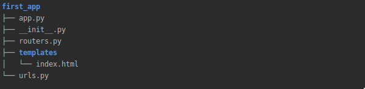

.. _create_first_app:

-------------------------------------------------------------------------------
Hello world application
-------------------------------------------------------------------------------

In fact, if you don't need databases, settings, additional logic, and you just want to receive requests and send
responses, you can simply create a python file, fill it with the code below, and you're done. For example, we just want
to respond to every request with JSON. Let's create a Python file called `hello.py` with the following code.

.. code-block:: python

    from crax.response_types import JSONResponse

    async def app(scope, receive, send):
        response = JSONResponse(None, {"Hello": "world"})
        await response(scope, receive, send)

Launch it in console.

.. code-block:: bash

   uvicorn hello:app

It should be noted that the **None** in the app coroutine is for the Crax Request instance we just skipped over.
However, it will work. In this case, you don't need to import any Crax instances, create a config file, and so on.

First application with Crax
======================================================
Building applications with Crax is as easy as the `Hello world` application described above.
Let's create our first simple application. Take a look at a simple bash script below.

.. code-block:: bash

    #!/usr/bin/env bash

    APP_DIR='first_app'

    mkdir -p ${APP_DIR}/templates
    touch ${APP_DIR}/templates/index.html
    touch ${APP_DIR}/__init__.py

    echo -e "from .urls import url_list\nfrom crax import Crax\n\nURL_PATTERNS = url_list\nAPPLICATIONS = ['${APP_DIR}']" >  ${APP_DIR}/app.py
    echo -e "app = Crax('${APP_DIR}.app')" >>  ${APP_DIR}/app.py
    echo -e "from crax.urls import Url, Route\nfrom ${APP_DIR}.routers import Home\nurl_list = [Route(Url('/'), Home)]" > ${APP_DIR}/urls.py
    echo -e "from crax.views import TemplateView\n\nclass Home(TemplateView):\n\ttemplate = 'index.html'\n" >  ${APP_DIR}/routers.py
    echo "My Crax First App" >  ${APP_DIR}/templates/index.html

This is the first application with a minimal config file, a file that contains your list of URLs, and a file called routers.py that stores your views.
We also created a directory named `templates` with a simple template named
`index.html`. A few words about the general architecture of Crax applications. For example, we could create `handlers.py`
to store our views (handlers) `routers.py` to store our URLs (routes) e.t.c. Only two names are strict for use.

All database models must be placed in files named `models.py` and
template files `* .html` must be stored in directories named `templates`. Otherwise, Crax won't be able to find the data.
Also, of course, the whole project can be written as one file if desired, but it is recommended to split Crax applications
for a group of applications that are structured as shown in the Create First Application example. There is one strict rule: all
your apps in the project (if you finally decide to split logic between apps) should be python packages.
It's not a mistake to think that the project structure is very similar to the Django project structure.
Good. Let's take a look at the contents of our files.

First of all, it is a python file named `app.py`. Of course, it could have been named anything (`settings.py`
or something different). It is the main file of your project. All of your settings and `Crax` application will be
stored here.

.. code-block:: python

    from .urls import url_list
    from crax import Crax

    URL_PATTERNS = url_list
    APPLICATIONS = ['first_app']
    app = Crax('first_app.app')

This is the minimum configuration that allows our application to work. As mentioned above, this file can be written without
any import as a single Python file. But our goal is to create an application in a "general way".

.. code-block:: python

    from crax.urls import Url, Route
    from crax.views import TemplateView

    class Home(TemplateView):
        template = 'index.html'

    URL_PATTERNS = [Route(Url('/'), Home)]
    APPLICATIONS = ['first_app']
    app = Crax('first_app.app')

`routers.py`

.. code-block:: python

    from crax.views import TemplateView

    class Home(TemplateView):
        template = 'index.html'

Here we just created a handler for our root url and called it Home. All about routing in the :ref:`routing` section.
As you can see, no need to define template directories in configuration file.
As you can see, there is no need to define template directories in the config file.
Crax will try to find it according to the applications specified in the APPLICATIONS variable.
All configuration details are in the  :ref:`settings` section.Also in this example we don't need to define any methods
in the home view, and this is not a bug. For more information on views (handlers) in :ref:`views` section.

`urls.py`

.. code-block:: python

    from crax.urls import Url, Route
    from .routers import Home

    url_list = [Route(Url('/'), Home)]

Let's launch our first simple application.

.. code-block:: bash

        uvicorn first_app.app:app

.. toctree::
   :maxdepth: 3
   :caption: Go dipper:

   create_more_complex

* :ref:`genindex`
* :ref:`search`
