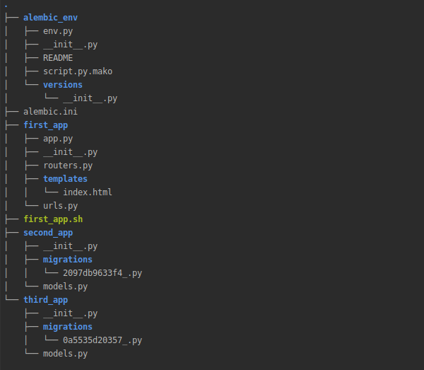
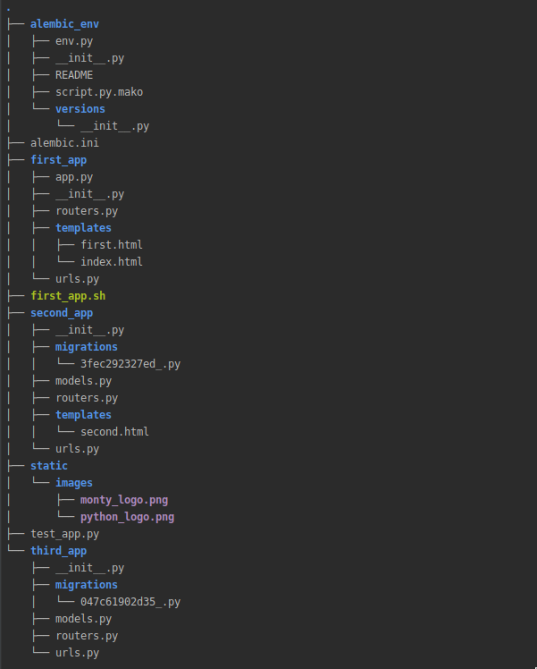

-------------------------------------------------------------------------------
More complex application
-------------------------------------------------------------------------------
Let's expand our `first app` with a little more logic.

.. image:: crax_images/first_app_tree.png
   :width: 600

We are going to create some more applications and create some more views.

So, we have created `second_app` and` third_app`, similar to the first. Let's create some more handlers,
models and routes. First of all, we are going to describe some database models, create a database and tell Crax about it.
Assuming we have installed Crax with the additional option `[postgresql]`, and we have installed and started the PostgreSQL server in
our system. It's time to tell we'll be maintaining the database.

Let's change the file `first_app/app.py` to tell Crax that we have a database.

.. code-block:: python

    import os
    import sys

    from crax import Crax
    from crax.commands import from_shell
    from first.urls import url_list

    BASE_URL = os.path.dirname(os.path.dirname(os.path.abspath(__file__)))

    URL_PATTERNS = url_list
    APPLICATIONS = ['first_app', 'second_app', 'third_app']

    DATABASES = {
        "default": {
            "driver": 'postgresql',
            "host": '127.0.0.1',
            "user": "crax",
            "password": "CraxPassword",
            "name": 'crax_database',
        }
    }
    app = Crax('first_app.app', debug=True)

    # This part enables command line support
    if __name__ == "__main__":
        if sys.argv:
            from_shell(sys.argv, app.settings)

That's all. Crax now knows that the project has a database. The `BASE_URL` variable is required for online
commands that we will use below. It's time to define some models. As mentioned, we need to modify our `app.py` file
to be able to use the Crax cli. We are now ready to create our database schema. Please note that your main file
should always contain an instance of Crax named `app`.

*second_app/models*:

.. code-block:: python

    from crax.auth.models import User
    from crax.database.model import BaseTable
    import sqlalchemy as sa

    from third_app.models import Company

    class UserProfile(BaseTable):
        bio = sa.Column(sa.String(length=100), nullable=False)
        age = sa.Column(sa.Integer(), nullable=True)

        class Meta:
            abstract = True

    class Customer(User, UserProfile):
        pass

    class Vendor(User, UserProfile):
        company_id = sa.Column(sa.Integer, sa.ForeignKey(Company.id))

*third_app/models*:

.. code-block:: python

    from crax.database.model import BaseTable
    import sqlalchemy as sa

    class Department(BaseTable):
        dept = sa.Column(sa.String(length=100), nullable=False)

    class Company(BaseTable):
        name = sa.Column(sa.String(length=100), nullable=False)
        department_id = sa.Column(sa.Integer, sa.ForeignKey(Department.id))

This is a very simple example where we imported the default user from Crax Authorization. Next, we created a model
named `UserProfile`. Finally, we created two models, `Client` and `Vendor`. Of course, no one does this in
production, because we could just inherit UserProfile from the `User`, and then inherit `Customer` and `Vendor` from
`UserProfile`. The goal is to show multiple inheritance. Also note that the UserProfile model is marked as
`abstract` means it will not be created in the database. All about Crax models see the :ref:`databases` section.
Finally, we created the Company and Department models and linked them to the `Vendor`. This is enough to
show the basics.
So we created our models, let's create migrations

.. code-block:: bash

    python first_app/app.py makemigrations

Well done. We have now created migrations for our models. Everything about Crax migration is described in :ref:`databases`
section.

Also has been created `alembic.ini` file and `alembic_env` directory that are necessary for database migrations. Run
in console:

.. code-block:: bash

    python first_app/app.py migrate

Now our database is ready to go. All models that are defined in our `models.py` files now are present in database.
Truly to say the example above not the single way to create database. All about database management commands see at
:ref:`databases` section. Just one more thing you should pay attention here. In our `app.py` file we haven't specified
any `Authorization` backends thus `User`, `UserGroup` and other default Crax authorization models wasn't created.
See all about authorization backends at Authorization section.
Ok. Go ahead and let's create some handlers.

`first_app/routers.py`

.. code-block:: python

    from crax.response_types import TextResponse
    from crax.views import TemplateView
    from jinja2 import Environment, PackageLoader

    class Home(TemplateView):
        # In case if want just render template and nothing more, we can
        # create simple view like this one
        template = 'index.html'

    async def guest_view_coroutine(request, scope, receive, send):
        # If we don't want to use class based views, we can
        # work function (coroutine) way
        env = Environment(
            loader=PackageLoader("first_app", "templates/"),
            autoescape=True
        )
        template = env.get_template("first.html")
        content = template.render()
        response = TextResponse(request, content)
        await response(scope, receive, send)

`second_app/routers.py`

.. code-block:: python

    import json

    from crax.views import BaseView, TemplateView
    from crax.response_types import TextResponse, JSONResponse
    from jinja2 import Environment, FileSystemLoader
    from sqlalchemy import and_, or_, select

    from second_app.models import Vendor, Customer
    from third_app.models import Company, Department

    class CustomersList(TemplateView):
        template = 'second.html'

        async def get(self):
            # Simplest query that get all customers with id less or equal to 100
            # and who is not staff user
            # In case if we use TemplateView we don't need to return anything
            # We just define "customers" key in kwargs dict which will be passed
            # automatically to the template
            query = Customer.table.select().where(
                and_(Customer.c.id <= 100,
                    or_(Customer.c.is_staff.is_(False),
                        Customer.c.is_staff.is_(None)))
            )
            self.context['customers'] = await Customer.query.fetch_all(query=query)

    class CreateCustomers(TemplateView):
        template = 'second.html'
        methods = ['GET', 'POST']
        # Here we have not defined the get method because we don't need
        # any extra logic. However template will be rendered.

        async def post(self):
            # We want to create bunch of customers at once
            # Note that Response instance should be returned
            await Customer.query.bulk_insert(values=json.loads(self.request.post))
            return TextResponse(self.request, 'Created')

    class VendorsList(BaseView):
        methods = ['GET', 'POST']

        async def get(self):
            # Opposite to TemplateView behaviour
            # In case if use BaseView to render templates
            # we always have to pass parameters to template renderer
            # and return response
            env = Environment(
                loader=FileSystemLoader(["second_app/templates", "first_app/templates"]),
                autoescape=True
            )
            template = env.get_template("second.html")
            vendors = await Vendor.query.all()
            self.context['vendors'] = vendors
            content = template.render(self.context)
            response = TextResponse(self.request, content)
            return response

        async def post(self):
            # We want to create single vendor and if any files are given in request
            # save all of that files
            if self.request.post:
                await Vendor.query.insert(values=json.loads(self.request.post))
            if self.request.files:
                for file in self.request.files:
                    await self.request.files[file].save()
            return TextResponse(self.request, 'Created')

    class VendorDetails(BaseView):
        methods = ['GET', 'DELETE', 'PATCH']

        async def get(self):
            env = Environment(
                loader=FileSystemLoader(["second_app/templates", "first_app/templates"]),
                autoescape=True
            )
            template = env.get_template("second.html")
            # Here we are going to get vendor details by given parameter "vendor_id"
            # We want to know vendor's company name and department name
            params = self.request.params
            query = select([Vendor.c.username, Company.c.name, Department.names]).where(
                Vendor.c.id == int(params['vendor_id'])
            )
            vendor = await Vendor.query.fetch_one(query=query)
            self.context['vendor'] = vendor
            content = template.render(self.context)
            response = TextResponse(self.request, content)
            return response

        async def delete(self):
            # Delete vendor by given "vendor_id"
            await Vendor.query.execute(query=Vendor.table.delete().where(
                Vendor.c.id == int(self.request.params['vendor_id'])
            ))

        async def patch(self):
            # Update vendor's data by given "vendor_id"
            await Vendor.query.execute(
                query=Vendor.table.update().where(
                    Vendor.c.id == int(self.request.params["vendor_id"])).values(
                    json.loads(self.request.post))
            )
            response = JSONResponse(self.request, self.context)
            return response

`third_app/routers.py`

.. code-block:: python

    import json

    from crax.views import BaseView
    from crax.response_types import TextResponse, JSONResponse
    from jinja2 import Environment, FileSystemLoader
    from sqlalchemy import and_

    from third_app.models import Company, Department

    class CompanyList(BaseView):
        methods = ['GET']

        async def get(self):
            env = Environment(
                loader=FileSystemLoader(["third_app/templates", "first_app/templates"]),
                autoescape=True
            )
            template = env.get_template("third.html")
            self.context['companies'] = await Company.query.all()
            content = template.render(self.context)
            response = TextResponse(self.request, content)
            return response

    class CompanyDetails(BaseView):
        methods = ['GET', 'POST', 'PATCH']

        async def get(self):
            # Dummy example of case if we have an additional parameter in uri
            # It can be that department_id presents in parameters or not

            env = Environment(
                loader=FileSystemLoader(["third_app/templates", "first_app/templates"]),
                autoescape=True
            )
            template = env.get_template("third.html")
            params = self.request.params
            if params['department_id'] is not None:
                query = Company.table.select().where(and_(
                    Company.c.id == int(params['company_id']),
                    Company.c.department_id == int(params['department_id']))
                )
            else:
                query = Company.table.select().where(Company.c.id == int(params['company_id']))
            self.context['companies'] = await Company.query.fetch_all(query=query)
            content = template.render(self.context)
            response = TextResponse(self.request, content)
            return response

        async def post(self):
            params = self.request.params
            if params['department_id'] is not None:
                await Department.query.insert(values=json.loads(self.request.post))
                return TextResponse(self.request, 'Created')
            else:
                await Company.query.insert(values=json.loads(self.request.post))
                return TextResponse(self.request, 'Created')

        async def patch(self):
            await Company.query.execute(
                query=Company.table.update().where(
                    Company.c.id == int(self.request.params["company_id"])).values(
                    json.loads(self.request.post))
            )
            response = JSONResponse(self.request, self.context)
            return response

Well done. So, as far as we have created some handlers we possibly would like to tell Crax that we have some new
handlers. All information about Crax Views is in the :ref:`views` section. Let's define url lists.

`third_app/urls.py`

.. code-block:: python

    from crax.urls import Url, Route
    from third_app.routers import CompanyList, CompanyDetails

    url_list = [
        Route(Url('/companies'), CompanyList),
        Route(
            Url(
                r"/company/(?P<company_id>\d+)/(?:(?P<department_id>\w+))?", type="re_path"
            ),
            handler=CompanyDetails,
        )
    ]

The code above tells Crax that it needs to manage two urls. The first URL is simple and requires no parameters.
The second takes one required parameter `company_id` and one floating (optional) parameter `department_id`.
Url resolver will manage correctly uri with one or two parameters. If the optional parameter is missing,
will be set to None. Also, second url is marked as `re_path`, so that means that Crax should process it,
using regular expressions. All about routing you can see at :ref:`routing` section.

`second_app/urls.py`

.. code-block:: python

    from crax.urls import Url, Route
    from second_app.routers import CustomersList, CreateCustomers, VendorsList, VendorDetails

    url_list = [
        Route(Url('/customers'), CustomersList),
        Route(Url('/create_customers'), CreateCustomers),
        Route(Url('/vendors'), VendorsList),
        Route(Url('/vendor/<vendor_id>/'), VendorDetails)
    ]

The urls in `second_app/urls.py` are not marked as `re_path`, so Crax will handle them in the usual way.
As you can see, some URLs have a closing slash and some don't. It's not a mistake. Crax will work
correct with both options. It doesn't matter if you added it or not. It also doesn't matter if the user adds it or not.
In :ref:`routing` section you can find out how to define several urls with same handler or about
routing in `masquerade mode`.

`first_app/urls.py`

.. code-block:: python

    from crax.urls import Url, Route, include
    from first_app.routers import Home, guest_view_coroutine

    url_list = [
        Route(Url('/'), Home),
        Route(Url('/guest_book'), guest_view_coroutine),
        include('second_app.urls'),
        include('third_app.urls')
    ]

So we defined the url lists according to its application and finally included it in the main url list.
The list of main URLs can be anywhere in our project or somewhere else. There is strictly one thing here - Python imports.
If Python can import your module, everything will work fine. Of course you can define all urls in one place and that would be
straight to. But for now we want to work with `namespaces`. To know more about `namespaces`, `nested namespaces` and other
things, go to :ref:`routing` section.
Finally we have to create some templates and some media files. `first_app/templates/first.html`, `second_app/templates/second.html`
and `static/images`.

All about Crax templates see at :ref:`templates_static` section.

Good. Our simple application is now ready to perform all CRUD actions on all defined instances. Run your application in
console.
Finally we will have something like that.

.. code-block:: bash

   uvicorn first_app.app:app

Let's define some tests.

`test_app.py`

.. code-block:: python

    import asyncio
    import os

    import requests

    from second_app.models import Vendor
    from third_app.models import Department, Company

    users = [
                {
                    "username": "jamie",
                    "password": "qwerty",
                    "first_name": "James",
                    "bio": "Python Developer",
                },
                {
                    "username": "rob",
                    "password": "qwerty",
                    "first_name": "Robert",
                    "bio": "Python Developer",
                },
                {
                    "username": "tom",
                    "password": "qwerty",
                    "first_name": "Tomas",
                    "bio": "Python Developer",
                },
            ]

    def create_customers():
        create = requests.post('http://127.0.0.1:8000/second_app/create_customers', json=users)
        assert create.content.decode('utf-8') == 'Created'
        assert create.status_code == 201

    def create_vendor():
        for vendor in users:
            create = requests.post('http://127.0.0.1:8000/second_app/vendors', json=vendor)
            assert create.content.decode('utf-8') == 'Created'
            assert create.status_code == 201

    def save_files():
        files = {f'upload_file_{x}': open(f'static/images/{y}', 'rb') for x, y in enumerate(os.listdir('static/images'))}
        create = requests.post('http://127.0.0.1:8000/second_app/vendors', files=files)
        assert create.content.decode('utf-8') == 'Created'
        assert create.status_code == 201

    async def create_company():
        department = {'dept': 'Department Name'}
        create = requests.post('http://127.0.0.1:8000/third_app/company/1/1/', json=department)
        assert create.content.decode('utf-8') == 'Created'
        assert create.status_code == 201
        os.environ["CRAX_SETTINGS"] = 'first_app.app'
        dept = await Department.query.last()
        company = {'name': 'Company Name', 'department_id': dept['id']}
        create = requests.post('http://127.0.0.1:8000/third_app/company/1/', json=company)
        assert create.content.decode('utf-8') == 'Created'
        assert create.status_code == 201

    async def update_company():
        new_company = {'name': 'New Company Name'}
        os.environ["CRAX_SETTINGS"] = 'first_app.app'
        company = await Company.query.last()
        update = requests.patch(f'http://127.0.0.1:8000/third_app/company/{company["id"]}/', json=new_company)
        assert update.status_code == 204

    async def update_vendor():
        os.environ["CRAX_SETTINGS"] = 'first_app.app'
        company = await Company.query.last()
        vendors = await Vendor.query.all()
        new_vendor = {'company_id': int(company["id"])}
        for vendor in vendors:
            update = requests.patch(f'http://127.0.0.1:8000/second_app/vendor/{vendor["id"]}/', json=new_vendor)
            assert update.status_code == 204

    create_customers()
    create_vendor()
    save_files()

    loop = asyncio.new_event_loop()
    loop.run_until_complete(create_company())
    loop.run_until_complete(update_company())
    loop.run_until_complete(update_vendor())

There are two important things in this test file.
First, please look at the URLs in our requests. All URLs are divided by application.
For example url `vendor/<vendor_id>/` is defined in `second_app` and is included in the main url list using
`include function` from `crax.urls`. This way, all urls will be prefixed with `second_app`. See section :ref:`routing` for details.
Second point: we have our application running, and we have another application that we want to communicate with.
with the first. Look at the code below

.. code-block:: python

    async def update_vendor():
        os.environ["CRAX_SETTINGS"] = 'first_app.app'
        company = await Company.query.last()
        vendors = await Vendor.query.all()
        new_vendor = {'company_id': int(company["id"])}
        for vendor in vendors:
            update = requests.patch(f'http://127.0.0.1:8000/second_app/vendor/{vendor["id"]}/', json=new_vendor)
            assert update.status_code == 204

We have access to the models defined in our application and the database defined in the configuration of our project.
This way we can send requests, receive responses and work with the database. All you need to do is just set the CRAX_SETTINGS key.
in your environment. The value is a string describing which configuration (application) you want to work with.
Let's go ahead and add some extra code to our coroutine.

.. code-block:: python

    async def update_vendor():
        os.environ["CRAX_SETTINGS"] = 'first_app.app'
        company = await Company.query.last()
        vendors = await Vendor.query.all()
        new_vendor = {'company_id': int(company["id"])}
        for vendor in vendors:
            update = requests.patch(f'http://127.0.0.1:8000/second_app/vendor/{vendor["id"]}/', json=new_vendor)
            assert update.status_code == 204

        # Here we possibly want to get access to some data that defined at our project configuration.
        from crax.utils import get_settings_variable
        base_url = get_settings_variable('BASE_URL')
        print(base_url)

So now we have created the first application using Crax. You can see how easy and convenient it is.
Summary: To build apps using Crax, you must define one main python file. It doesn't matter how you will
name this file, but it should always contain an instance of Crax - a variable named `app`.

.. code-block:: python

    app = Crax('first_app.app', debug=True)

This is the main file for your project, located in any application (package) of your project.

.. code-block:: python

    # This part enables command line support
    if __name__ == "__main__":
        if sys.argv:
            from_shell(sys.argv, app.settings)

If you are going to use command line tools, you should put the following code in your main (config) file.
One last thing: all your applications must be python packages and must be listed in your main file.

* :ref:`genindex`
* :ref:`search`
