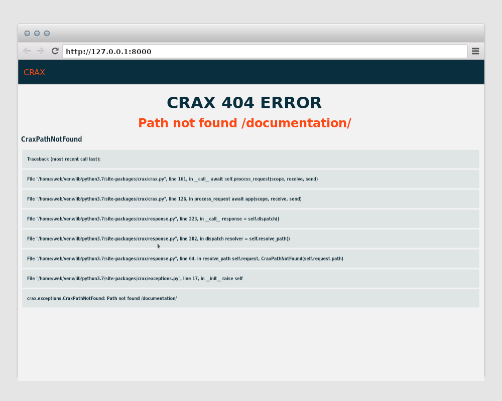

.. _exceptions:

-------------------------------------------------------------------------------
**CRAX** Exceptions
-------------------------------------------------------------------------------
Crax always runs in production by default, but during development you may need to
enable debug mode. So in your main project file, set it up.

.. code-block:: python

    from crax import Crax

    app = Crax(settings="crax_docs.app", debug=True)

You can now see all errors and traceback in your browser.

Good. Let's get Crax back online. When our application is in production mode, we always
want to handle our errors and provide users with beautiful error pages.
You can define error handlers for any possible error status code in the configuration file.

**ERROR_HANDLERS** Variable defining custom error handlers. The dict type of the callee.
You can define a dict with error handlers for each expected error status code.
Rule: the keys of this dict should be written as `ERROR_STATUS_CODE_handler`.
The values ​​for this dict can be of any kind that support ASGI signature. For example:

.. code-block:: python

    class NotFoundHandler(TemplateView):
        template = '404.html'

        async def get(self):
            self.status_code = 404

    class ServerErrorHandler(TemplateView):
        template = '500.html'

        async def get(self):
            self.status_code = 500

    ERROR_HANDLERS = {'404_handler': NotFoundHandler, '500_handler': ServerErrorHandler}

In production mode. If your application has an error with the status defined in the dict `ERROR_HANDLERS`,
the handler of which is a value, will process the request. In case your application got an error with a status code
that is not defined in `ERROR_HANDLERS`, the request will be handled with the handler for error `500`.
If neither a `500` error handler nor a current error handler is defined, the application will show the default error
page ("Internal Server Error" or any other default text). The above code is enough to just return a nice error page,
but of course it can be extended with some logic like sending notifications to your sysadmin.

**Built-in exceptions**:
    There are some built in exceptions.

    **CraxUnauthorized**
        error message: "Not Authorized"

        status_code: 401

        Will be raised in case of unauthorized user tries get `login_required` resources.

    **CraxForbidden**
        error message: "Access Denied"

        status_code: 403

        Will be raised in case of user tries get resources with insufficient rights.

    **CraxTemplateNotFound**
        error message: "Template not found"

        status_code: 404

        The template to render not found.

    **CraxPathNotFound**
        error message: "Path not found"

        status_code: 404

        Path not found.

    **CraxImproperlyConfigured**
        error message: "Invalid configuration: "

        status_code: 500

        There is something wrong with the config file. The details will be shown after the colon in the error message.

    **CraxNoTemplateGiven**
        error message: "No method was given for the view"

        status_code: 500

        Means that you have defined a TemplateView based handler, but forgot to define a template to render.

    **CraxEmptyMethods**
        error message: "No methods was specified for the view"

        status_code: 500

        Means that methods argument is overridden with an empty list.

    **CraxMethodNotAllowed**
        error message: "Method not allowed for this view"

        status_code: 405

        Means that request method not in the list of available methods for this view.

    **CraxDataBaseImproperlyConfigured**
        error message: "Database connection improperly configured"

        status_code: 500

        Something wrong with your database settings.

    **CraxDataBaseNotFound**
        error message: "Database not found"

        status_code: 500

        Invalid or missing database key in your databases dict.

    **CraxMigrationsError**
        error message: "Migration Error"

        status_code: 500

        Will be raised in case of problems with migrations.

    **CraxUnknownUrlParameterTypeError**
        error message: "Swagger Error"

        status_code: 500

        Are you trying to create a variable type that is not valid for the OpenAPI specification, or
        do it wrong according to Crax documentation.

