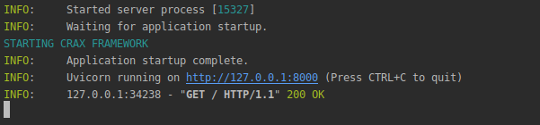
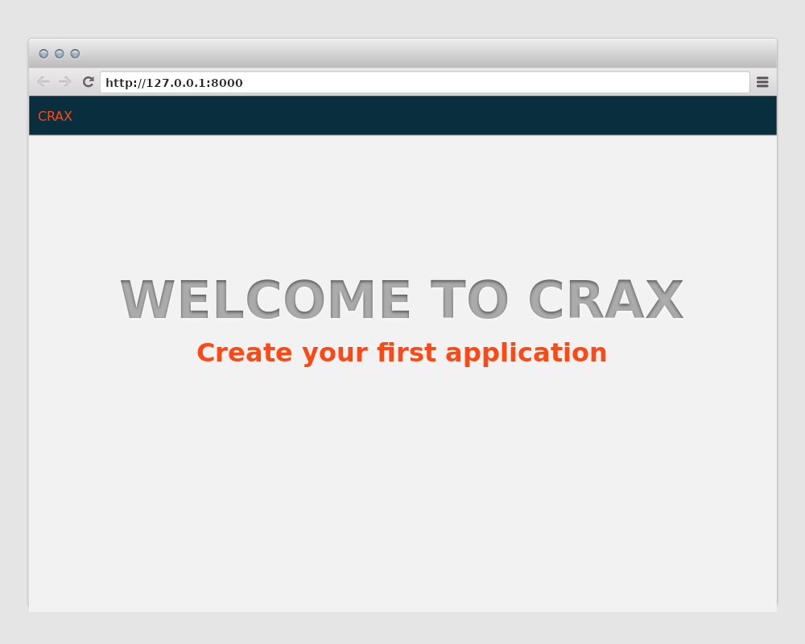

.. _intro:

QuickStart CRAX
-----------------------------------------------
Once you have Crax and ASGI server installed, you can create a simple blank project.
Create a python file named `app.py`, `run.py` or whatever name you like. Good. Let it be `app.py`.
Place the following code in `app.py`. That's all. An empty project has been successfully created.

.. code-block:: python

    from crax import Crax

    app = Crax()

Launch application in console.

.. code-block:: bash

   uvicorn app:app

You will see that Uvicorn and Crax are running. This documentation is not about configuring ASGI servers,
so if you need specific things, check out `Uvicorn <https://www.uvicorn.org/>`_ for details.

Open your favorite browser at *127.0.0.1:8000*, and you will see Crax default page.

This is an important step, if you are going to use the Crax console commands you must update
An `app.py` file with three lines of code. If you don't need features like `migrations` or so
skip this step. Let's modify `app.py` to be able to run cli commands.

.. code-block:: python

    import sys

    from crax import Crax
    from crax.commands import from_shell

    app = Crax(settings="my_first_app.app", debug=True)

    if __name__ == "__main__":
        if sys.argv:
            from_shell(sys.argv, app.settings)

After that you can run the Crax cli commands. Good. Let's take a look at the modified app.py file.
We added support for the cli command and set the Crax app to debug mode. By default, debug mode is off, so
to change this behavior, you must enable debug mode to True. What does debug mode mean.
The point is that all errors in your application will be displayed in the browser.
See the :ref:`exceptions` for details.
As you can see, we have also defined our application config file. See the :ref:`settings` for details.

.. toctree::
   :maxdepth: 3
   :caption: What's next?:

   create_first_app
   create_more_complex

.. index::
   QuickStart CRAX