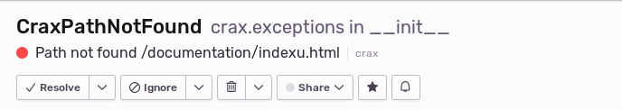

.. _logging:

Logging
-----------------------------------------------

Crax logging is disabled by default. This means that no action, even errors, will be logged.
To change this behavior, you must set the settings variable to True.
** DISABLE_LOGS ** The bool type. Enables logging.
After you have enabled the logging backend, you might want to customize it.

**LOG_FORMAT** Variable that sets log formatting in your project log file. Default value is
`"%(asctime)s — %(name)s — %(levelname)s — %(message)s"`

**LOGGER_NAME** Sets logger name for `logging.getLogger(name)` function. See details at
`Logging facility for Python <https://docs.python.org/3/library/logging.html/>`_. Default name is "crax".

**LOG_LEVEL** Sets logger warn level. Type of string. Default value is "INFO".

**LOG_CONSOLE** Sets should logger or not stream to console. Type of bool. Default is False.

**LOG_STREAMS** Set what streams logger should to use. Type of list. Default value is [sys.stdout, sys.stderr]

**LOG_ROTATE_TIME** Defines log rotation time. Type of string. Default value is "midnight".

**LOGGING_BACKEND** Defines a custom server-side logging module. If for some reason you do not want to use
Crax default logging backend, you can write your own. When finished, tell Crax about it.
The type of dot-delimited string. The default is crax.logger.CraxLogger.

.. code-block:: python

    # Actually you don't need import anything. It is just example shows the rule of definition
    from my_shiny_logger import SuperLogger

    LOGGING_BACKEND = "my_shiny_logger.SuperLogger"

**ENABLE_SENTRY** Includes Sentry support. Crax Logging can work with Sentry out of the box, but
it is generally disabled as logging. If you want to enable it, set this variable to True.
Note that if you set Sentry support to "ON", you must define your Sentry credentials.

**LOG_SENTRY_DSN** Set your sentry credentials. No defaults.
Example:

.. code-block:: python

    LOG_SENTRY_DSN = "https://bec19d6034916d99856d876de05e18b2@o411613.ingest.sentry.io/2875096"

Once you provided your Sentry credentials your Sentry is ready to go.
Let's customize it.
**SENTRY_LOG_LEVEL** Set Sentry's log level. Default value is equal to **LOG_LEVEL** variable thus if you
don't want set different warn levels to server and Sentry, just skip it.

**SENTRY_EVENT_LEVEL** variable that sets Sentry's event level. Type of string. Default value is "ERROR".

Please do not forget install Sentry.

.. code-block:: bash

    pip install --upgrade sentry-sdk

Finally, your config file might look something like this

.. code-block:: python

    DISABLE_LOGS = False
    ENABLE_SENTRY = True
    LOG_SENTRY_DSN = "https://bec19d6034916d99856d876de05e18b2@o411613.ingest.sentry.io/2875096"

So you're ready to receive Sentry alerts.

Finally, we're going to write our own logging backend.
So if you don't want to use the default logging backend, you can write your own.
There are two rules for creation your logging backends.

The first is:

    Your backend must be inherited from Crax `Base Logger`

And the last is:

    Your logger must implement the ** get_logger ** method, otherwise you will receive an error.

.. code-block:: python

    # logger.py

    from crax.logger import BaseLogger

    class MyLogger(BaseLogger):
        def get_logger(self) -> logging.Logger:
            logger = logging.getLogger("my_app_logger")
            handler = logging.handlers.RotatingFileHandler('my_app.log', 'a', 300, 10)
            formatter = logging.Formatter('%(asctime)s %(processName)-10s %(name)s %(levelname)-8s %(message)s')
            handler.setFormatter(formatter)
            logger.addHandler(handler)
            return logger

    # conf.py

    LOGGING_BACKEND = "my_app.logger.MyLogger"

.. toctree::
   :maxdepth: 3
   :caption: Contents:

.. index::
   Logging