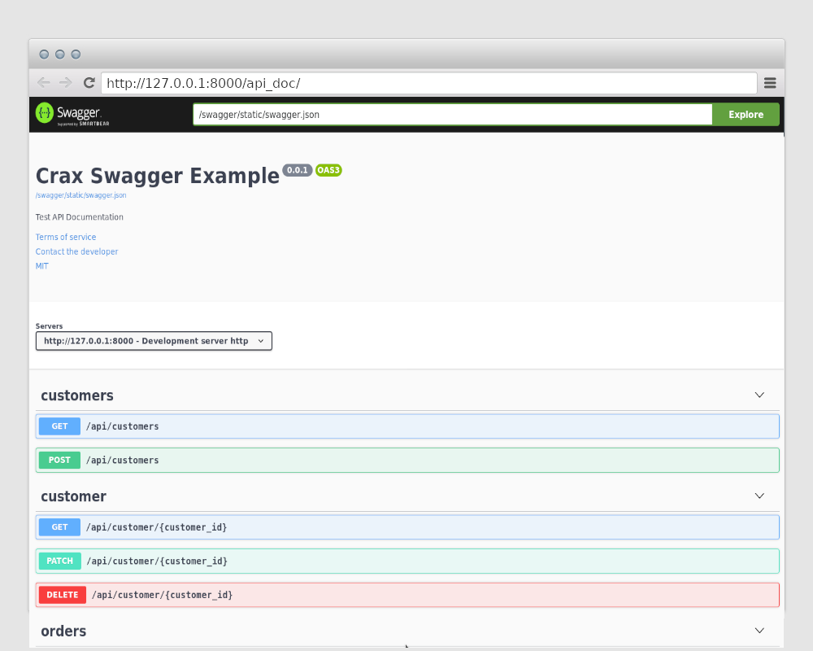
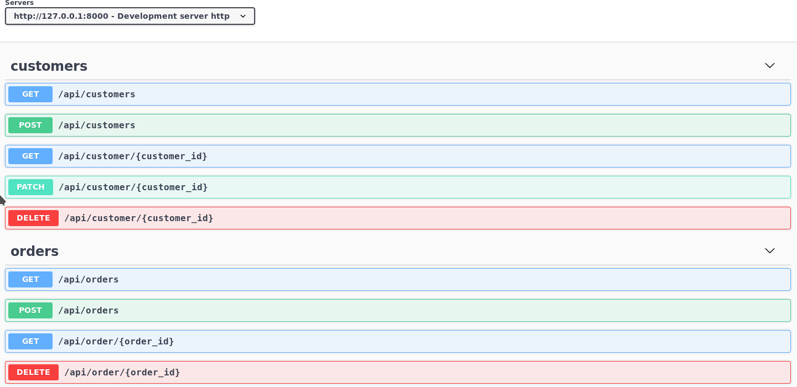
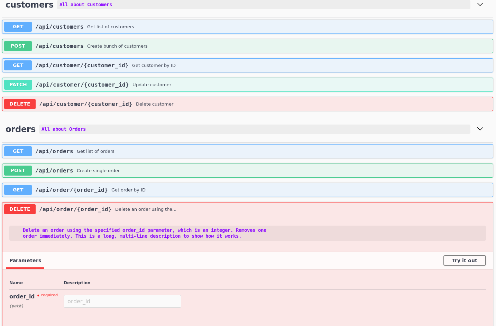
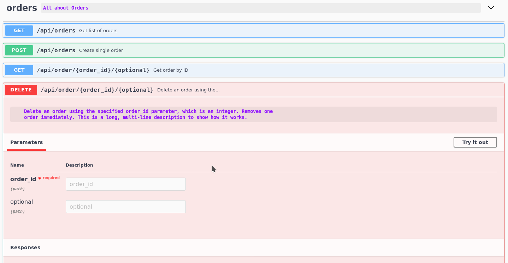
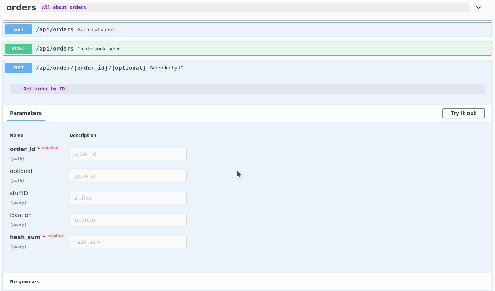
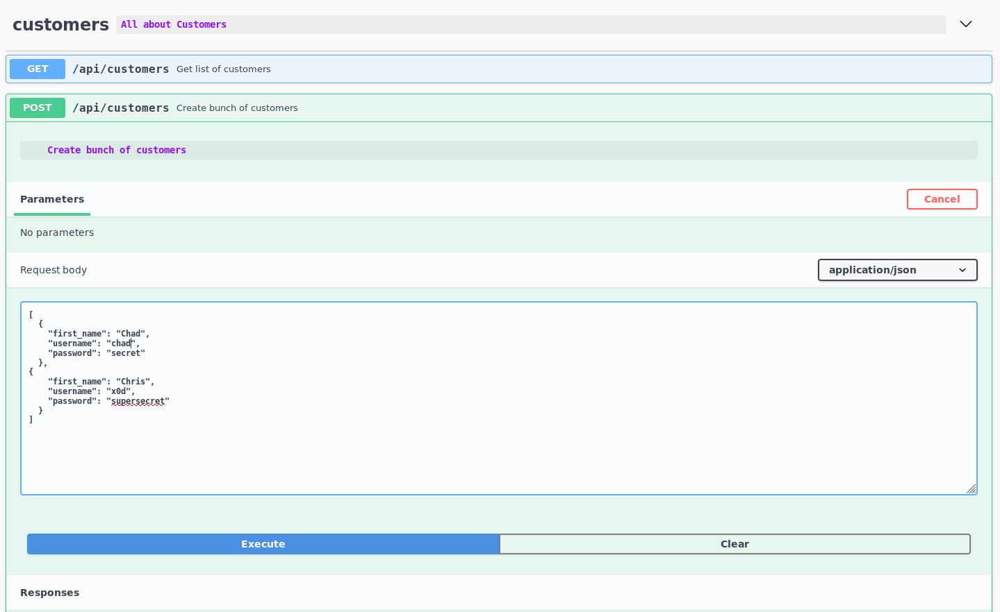
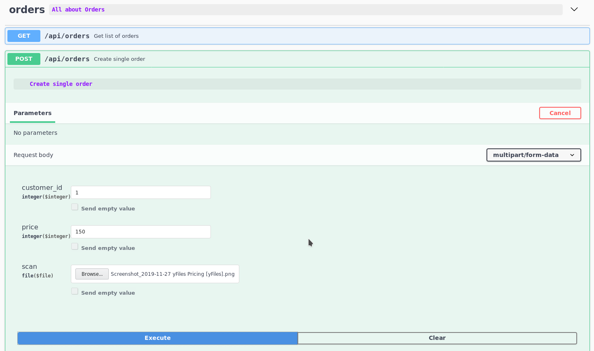
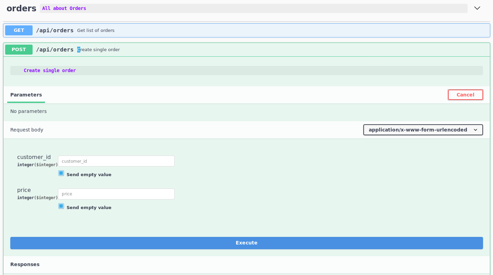
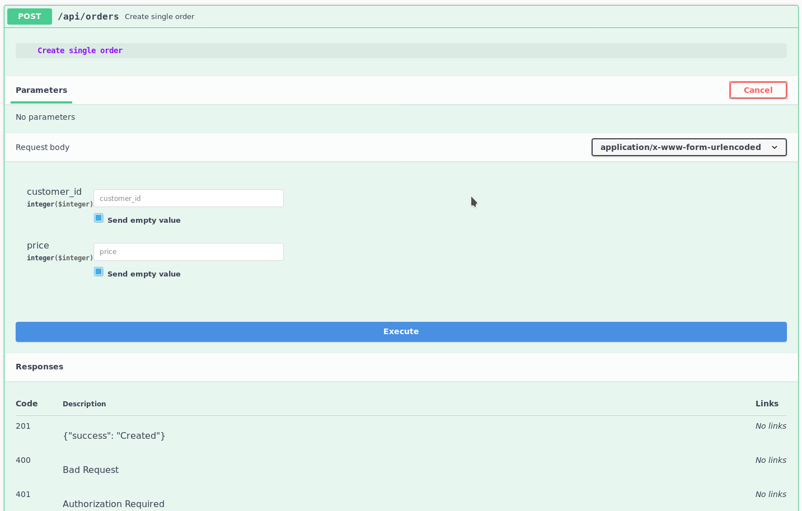

.. _openapi:

Swagger
-----------------------------------------------

In the previous chapter, we created a simple API that handles requests. So now we want
to generate OpenAPI documentation. Crax can do the job out of the box. First of all
remember the structure of our simple API.

.. code-block:: bash

    mkdir test_api
    cd test_api && touch models.py && touch app.py

So we have described two models in our `models.py` file.

.. code-block:: python

    from crax.auth.models import User
    from crax.database.model import BaseTable

    import sqlalchemy as sa

    class Customer(User):
        table_name = "customers"

    class Order(BaseTable):
        table_name = "orders"
        stuff = sa.Column(sa.String(length=100), nullable=False)
        price = sa.Column(sa.Integer, nullable=False)
        customer_id = sa.Column(sa.Integer, sa.ForeignKey(Customer.id), nullable=True)

Finally, we put all the rest of the code in our `app.py` file.

.. code-block:: python

    import json
    import os
    import sys

    from crax import Crax
    from crax.commands import from_shell
    from crax.response_types import JSONResponse
    from crax.urls import Route, Url
    from crax.views import BaseView
    from sqlalchemy import select

    from test_api.models import Customer, Order

    class Customers(BaseView):

        methods = ["GET", "POST"]

        async def get(self):
            self.context = await Customer.query.all()
            response = JSONResponse(self.request, self.context)
            return response

        async def post(self):
            data = json.loads(self.request.post)
            await Customer.query.bulk_insert(values=data)
            self.context = {"success": "Created"}
            response = JSONResponse(self.request, self.context)
            return response

    class CustomerDetails(BaseView):

        methods = ["GET", "PATCH", "DELETE"]

        async def get(self):
            query = select([Customer.c.id]).where(
                Customer.c.id == int(self.request.params["customer_id"])
            )
            self.context = await Customer.query.fetch_one(query=query)
            response = JSONResponse(self.request, self.context)
            return response

        async def patch(self):
            data = json.loads(self.request.post)
            Customer.query.execute(Customer.table.update().where(
                Customer.c.id == self.request.params["customer_id"]).values(data)
            )
            response = JSONResponse(self.request, self.context)
            return response

        async def delete(self):
            await Customer.query.execute(
                query=Customer.table.delete().where(
                    Customer.c.id == int(self.request.params["customer_id"])
                )
            )
            response = JSONResponse(self.request, self.context)
            return response

    class Orders(BaseView):
        methods = ["GET", "POST"]

        async def get(self):
            self.context = await Order.query.all()
            response = JSONResponse(self.request, self.context)
            return response

        async def post(self):
            data = json.loads(self.request.post)
            await Order.query.insert(values=data)
            response = JSONResponse(self.request, {"success": "Created"})
            return response

    class OrderDetails(BaseView):
        methods = ["GET", "DELETE"]

        async def get(self):
            self.context = await Order.query.fetch_one(
                query=Order.table.select().where(Order.c.id == int(self.request.params["order_id"]))
            )
            response = JSONResponse(self.request, self.context)
            return response

        async def delete(self):
            query = Order.table.delete().where(Order.c.id == int(self.request.params["order_id"]))
            self.context = await Order.query.execute(query=query)
            response = JSONResponse(self.request, self.context)
            return response

    BASE_URL = os.path.dirname(os.path.dirname(os.path.abspath(__file__)))

    URL_PATTERNS = [
            Route(urls=(Url("/api/customers")), handler=Customers),
            Route(Url("/api/customer/<customer_id>"), handler=CustomerDetails),

            Route(Url("/api/orders"), handler=Orders),
            Route(Url("/api/order/<order_id>"), handler=OrderDetails)
        ]

    APPLICATIONS = ['test_api']

    DATABASES = {
        "default": {
            "driver": 'sqlite',
            "name": f'/{BASE_URL}/swagger.sqlite',
        }
    }

    app = Crax(settings="test_api.app", debug=True)

    # Please note that we have to enable command line support
    if __name__ == "__main__":
        if sys.argv:
            from_shell(sys.argv, app.settings)

We are now ready to create our documentation. First, we need to import into instances.

.. code-block:: python

    from crax.swagger.types import SwaggerInfo
    from crax.swagger import urls

`SwaggerInfo` is a Python data class that describes the basics of your project, such as `description`, `version`, `terms`.

**SwaggerInfo** takes arguments:

    **description** String type. Your project description.

    **version** String type. Your interactive documentation/project version.

    **title** String type. Your documentation title.

    **termsOfService** String type. Your terms and conditions.

    **contact** Dict type. Your contact information.

    **license** Dict type. Your project license info.

    **servers** List type. List of servers that Swagger can send requests to.

    **basePath** String type. Base url for all of your endpoints.

So, if we want to enable Swagger support, we must define variable named `SWAGGER` in our `app.py`

.. code-block:: python

    SWAGGER = SwaggerInfo(
        description="Test API Documentation",
        version="0.0.1",
        title="Crax Swagger Example",
        termsOfService="https://github.com/ephmann/crax",
        contact={"email": "info@example.com"},
        license={"name": "MIT", "url": "https://opensource.org/licenses/MIT"},
        servers=[
            {"url": "http://127.0.0.1:8000", "description": "Development server http"},
            {"url": "https://127.0.0.1:8000", "description": "Staging server"},
        ],
        basePath="/api",
    )

Next we should modify your urls to let `Swagger` know how to work with url parameters.

.. code-block:: python

    from crax.swagger import urls

    URL_PATTERNS = [
            Route(urls=(Url("/api/customers")), handler=Customers),
            # Here we are telling Swagger that the url parameter "customer_id" is an integer.
            Route(Url("/api/customer/<customer_id:int>"), handler=CustomerDetails),

            Route(Url("/api/orders"), handler=Orders),
            # Same for the "order_id"
            Route(Url("/api/order/<order_id:int>"), handler=OrderDetails)
        ] + urls

    # And finally, we add Swagger urls to our url patterns

And that's all. We are now ready to create our simple interactive documentation for OpenAPI 3.0.\*

Open the console and type.

.. code-block:: bash

    python test_api/app.py create_swagger

You did it. Now your documentation is available at the `http://127.0.0.1:8000/api_doc/`.
Launch your application.

.. code-block:: bash

    uvicorn test_api.app:app

It worked. But not everything is so good, right? Take a look at the screenshot. Our `customer` and `customers` endpoints
must be in the same group, but not separated. Let's do it the right way.

.. code-block:: python

    from crax.swagger import urls

    URL_PATTERNS = [
        Route(urls=(Url("/api/customers")), handler=Customers),
        Route(Url("/api/customer/<customer_id:int>", tag="customers"), handler=CustomerDetails),

        Route(Url("/api/orders"), handler=Orders),
        Route(Url("/api/order/<order_id:int>", tag="orders"), handler=OrderDetails)
    ] + urls

We added a `tag` argument to our URLs to tell Swagger that these URLs should be bound to a specific group.
We could also use the tag argument to place any endpoint in any group. In this example, we could put everything
endpoints into a `customers` group, but we just put the endpoints together correctly.

Rebuild swagger.

.. code-block:: bash

    python app.py create_swagger

Good. This is much better, but not very good yet. Our documentation is not actually documented.
If your QA guys look at such documentation, they will be upset. To create Swagger descriptions you should use
python docstrings.

.. code-block:: python

    class Customers(BaseView):
        """
        All about Customers
        """
        methods = ["GET", "POST"]

        async def get(self):
            """
            Get list of customers
            """
            self.context = await Customer.query.all()
            response = JSONResponse(self.request, self.context)
            return response

        async def post(self):
            """
            Create bunch of customers
            """
            data = json.loads(self.request.post)
            await Customer.query.bulk_insert(values=data)
            self.context = {"success": "Created"}
            response = JSONResponse(self.request, self.context)
            return response

    class CustomerDetails(BaseView):

        methods = ["GET", "PATCH", "DELETE"]

        async def get(self):
            """
            Get customer by ID
            """
            query = select([Customer.c.id]).where(
                Customer.c.id == int(self.request.params["customer_id"])
            )
            self.context = await Customer.query.fetch_one(query=query)
            response = JSONResponse(self.request, self.context)
            return response

        async def patch(self):
            """
            Update customer
            """
            data = json.loads(self.request.post)
            Customer.query.execute(Customer.table.update().where(
                Customer.c.id == self.request.params["customer_id"]).values(data)
            )
            response = JSONResponse(self.request, self.context)
            return response

        async def delete(self):
            """
            Delete customer
            """
            await Customer.query.execute(
                query=Customer.table.delete().where(
                    Customer.c.id == int(self.request.params["customer_id"])
                )
            )
            response = JSONResponse(self.request, self.context)
            return response

    class Orders(BaseView):
        """
        All about Orders
        """
        methods = ["GET", "POST"]

        async def get(self):
            """
            Get list of orders
            """
            self.context = await Order.query.all()
            response = JSONResponse(self.request, self.context)
            return response

        async def post(self):
            """
            Create single order
            """
            data = json.loads(self.request.post)
            await Order.query.insert(values=data)
            response = JSONResponse(self.request, {"success": "Created"})
            return response

    class OrderDetails(BaseView):
        methods = ["GET", "DELETE"]

        async def get(self):
            """
            Get order by ID
            """
            self.context = await Order.query.fetch_one(
                query=Order.table.select().where(Order.c.id == int(self.request.params["order_id"]))
            )
            response = JSONResponse(self.request, self.context)
            return response

        async def delete(self):
            """
            Delete an order using the specified order_id parameter, which is an integer. Removes one
            order immediately. This is a long, multi-line description to show how it works.
            """
            query = Order.table.delete().where(Order.c.id == int(self.request.params["order_id"]))
            self.context = await Order.query.execute(query=query)
            response = JSONResponse(self.request, self.context)
            return response

We've added a few shortcuts to our groups and endpoints. The delete method of the OrderDetails class
rather long description. See below how your long descriptions will be truncated. Rule: The first five words will be shown.
as a short description. A full description will be shown inside the accordion.

As you can see in the screenshot, our "order_id" parameter is marked as required. That's right parameters are required.
If you have floating (optional) parameters, you should work with the `Url` type
`Re_path`. Let's change one of our routes to tell Swagger that some parameters are needed and some are not.

.. code-block:: python

    Route(Url(r"/api/order/(?P<order_id>\d+)/(?:(?P<optional>\w+))?", tag="orders",
                  type="re_path"), handler=OrderDetails),

.. code-block:: python

    Route(Url(r"/api/order/(?P<order_id>\d+)/(?P<customer_name>\w{0,30})/", tag="orders", type="re_path"), handler=OrderDetails),

    Route(Url("/api/order/<order_id:int>/<customer_name:str>/", tag="orders"), handler=OrderDetails)

Note, that in case of using type of `re_path` we use regular expressions operators to define which type of
url parameter.

Unfortunately, all our routers and URL parameters are marked as part of the path, but what if our route expects
any query arguments? Let's tell Swagger that one route is expecting query parameters.

.. code-block:: python

    class OrderDetails(BaseView):
        methods = ["GET", "DELETE"]

        async def get(self):
            """
            Get order by ID
            :par stuffID: int query
            :par location: str query
            :par hash_sum: str query required
            """
            self.context = await Order.query.fetch_one(
                query=Order.table.select().where(Order.c.id == int(self.request.params["order_id"]))
            )
            response = JSONResponse(self.request, self.context)
            return response

Look at the code. We defined three query parameters one with the type of integer and the rest with the string type.
And the last one is marked ad required.

Let's talk about the rules for defining parameters. These are lines located one below the other with a signature like:
`:par variable_name: variable_type variable_location required`. Please note that colons are required if you
miss at least one colon, you get not what you expected.

**Variable Types**
    All of Swagger (OpenAPI) `Data Types <https://swagger.io/docs/specification/data-models/data-types/>`_ can be
    defined using the first parameter after the colon.

    **int**
        Equals to Swagger type `integer`, format `int64`

    **float**
         Equals to Swagger type `number`, format `float`

    **str**
        Equals to Swagger type `string`, format `string`

    **date**
        Equals to Swagger type `string`, format `date`

    **date-time**
        Equals to Swagger type `string`, format `date-time`

    **password**
        Equals to Swagger type `string`, format `password`

    **bytes**
        Equals to Swagger type `string`, format `byte`

    **binary**
        Equals to Swagger type `string`, format `binary`

    **bool**
        Equals to Swagger type `boolean`

    **list**

        Equals to Swagger `array` with free form.

        `type: array`

        `items: {}`

    **dict**

        Equals to Swagger `object` with free form.

        `type: object`

        `additionalProperties: {}`

    **file**
        Equals to Swagger type `string`, format `binary`

**Variable Location**

    By default, if a parameter named **query** is not specified, all variables will be placed in the request body.
    In it is clear enough that all path parameters will be taken from defined urls, all query parameters will be
    taken from docstring as was described above (using the **query** argument) and the rest arguments from the
    docstrings will be placed to request body.

But how about we can have bulk insertion, singly insertion and different kinds of `content-types`. Let's talk
about it.
We remember that our handler `Customers` has the method `post` that is supposed to create bunch of users.
We want to create the documentation in such a way that we can try it out.

.. code-block:: python

    class Customers(BaseView):
        """
        All about Customers
        """
        methods = ["GET", "POST"]

        async def get(self):
            """
            Get list of customers
            """
            self.context = await Customer.query.all()
            response = JSONResponse(self.request, self.context)
            return response

        async def post(self):
            """
            Create bunch of customers
            :par bulk: true
            :par first_name: str required
            :par username: str
            :par password: str
            """
            data = json.loads(self.request.post)
            await Customer.query.bulk_insert(values=data)
            self.context = {"success": "Created"}
            response = JSONResponse(self.request, self.context)
            return response

Take a look at the code. In case we have defined a parameter named **bulk**, our request body will be a
list of dictionaries. This way we can try out our bulk insert.

And we also remember that our Orders handler has a post method that should create a single order.
Let's create the documentation assuming we are expecting to receive multipart / form-data containing some text fields.
and some binary data.

.. code-block:: python

    class Orders(BaseView):
        """
        All about Orders
        """
        methods = ["GET", "POST"]

        async def get(self):
            """
            Get list of orders
            """
            self.context = await Order.query.all()
            response = JSONResponse(self.request, self.context)
            return response

        async def post(self):
            """
            Create single order
            :par customer_id: int
            :par price: int
            :par scan: file
            :content_type: multipart/form-data
            """
            if self.request.files:
                for file in self.request.files:
                    await self.request.files[file].save()
            data = self.request.post
            await Order.query.insert(values=data)
            response = JSONResponse(self.request, {"success": "Created"})
            return response

**:content_type:** can also be **application/x-www-form-urlencoded**. Pay attention in this case in the parameters
there should be no binary data.

Why isn't Crax using the default name **:param:** or **:parameter:** from the Python docstrings? Just because the majority
the methods take no parameters, so the linter will highlight your weakly erroneous code.

Finally, we are going to describe our results. This is the well-known Python docstrings argument **:return:**
Let's imagine that we expect to receive status codes and descriptions.

.. code-block:: python

    class Orders(BaseView):
        """
        All about Orders
        """
        methods = ["GET", "POST"]

        async def get(self):
            """
            Get list of orders
            """
            self.context = await Order.query.all()
            response = JSONResponse(self.request, self.context)
            return response

        async def post(self):
            """
            Create single order
            :par customer_id: int
            :par price: int
            :par scan: file
            :content_type: multipart/form-data
            :return: 201 {"success": "Created"}
            :return: 400 Bad Request
            :return: 401 Authorization Required
            """
            if self.request.files:
                for file in self.request.files:
                    await self.request.files[file].save()
            data = self.request.post
            await Order.query.insert(values=data)
            response = JSONResponse(self.request, {"success": "Created"})
            return response

So now you can create Swagger interactive documentation with Crax.

.. toctree::
   :maxdepth: 3
   :caption: Contents:

.. index::
   Swagger