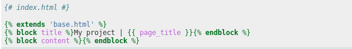
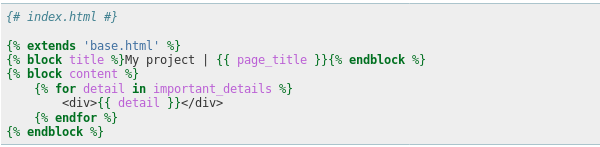
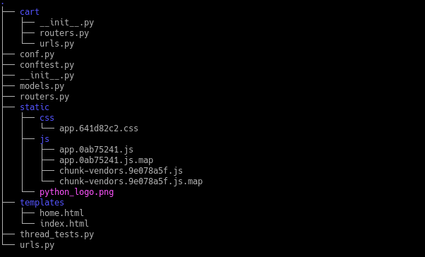

.. _templates_static:

Template rendering and Static Files
-----------------------------------------------

Render Templates
======================================================

uses the Jinja2 templating processor. All templates that you define in your handlers will render asynchronously.
See the `Jinja2 <https://jinja.palletsprojects.com/en/2.11.x/>`_ for all details. Anything you can do with Jinja2
you can do with Crax. First of all, it should be mentioned that you do not need to specifically define template directories.
This means that you only need to define your applications in the project config file.

.. code-block:: python

    APPLICATIONS = ['first_app', 'second_app', 'third_app']

You did it. Now create directories named `templates` inside any application you want.
`Jinja2 FileSystemLoader <https://jinja.palletsprojects.com/en/2.11.x/api/?highlight=loader#jinja2.FileSystemLoader>`_
will try to find your template in you project directories. If search is failed `TemplateNotFound` error will be raised.
Now you are ready to use your templates using Crax `TemplateView`. See all about views at :ref:`views` section.

.. code-block:: python

    class Home(TemplateView):
        # Note! You should no define full path to your template.
        # Just template name you want to render
        template = 'index.html'

This code is enough to easily display a template named `index.html`. Inheritance and template inclusion are also supported.

As you can see, everything you would expect to see when using Jinja2 is in the same places.

We are now going to pass some context variables to our template.

.. code-block:: python

    class Home(TemplateView):
        template = 'index.html'
        async def get(self):
            self.context['important_details']

You don't need anything else. Any data you passed to TemplateView.context will be rendered in your template.

The note! You can render templates in any other way, but the built-in `Template View` is literally for that.

Template Functions
======================================================
There are two built-in functions for rendering templates. All built-in Jinja modules are available too.

**url()**:
    This built-in function is for simple url creation.

    .. image:: crax_images/jinja_3.png
        :width: 600

    .. code-block:: python

        # urls.py

        urls = [
            Route(
                urls=(
                    Url("/test_param/<param_1>/<param_2>/", name="test_param"),
                    Url("/test_param"),
                ),
                handler=MySuperHandler
            ),
            Route(
                urls=(
                    Url(
                        r"/test_param_regex/(?P<param_1>\w{0,30})/(?P<param_2>\w{0,30})/",
                        type="re_path",
                    )
                ),
                handler==MySuperHandlerTwo
            )
        ]

    A simple example above is how to create URLs inside your templates. We have created two URLs. The first URL has the `name` argument
    And the second has not. It's not a mistake. You can specify the `name` parameter or omit it. But if you have defined
    The `name` argument is unique, you are sure the url will be generated correctly. So, if your pattern is unique and
    does not conflict with any project url, you can be sure. For everything about routing, see :ref:`routing`.

    This function takes the name of your URL as its first argument. The rest of the parameters are for arguments that
    your url pattern can accept. So the urls in the above example will render as:

    `/test_param/value_1/'value_2/`

**csrf_token()**:
    A function that creates a CSRF token. If you are going to use built-in CSRF protection for your requests, please enable it
    in your project config because it is disabled by default. See :ref:`settings` for details.
    So now you can generate and send CSRF tokens with your requests. Please note that the `SECRET_KEY` variable must be
    defined in your project settings.

    .. image:: crax_images/jinja_4.png
        :width: 600

Of course, you can define your own template functions to be included in the template rendering engine.
See :ref:`settings` for details.

Static Files
======================================================
In most cases, you might want your web server to serve static files. However, Crax can do the job too.
Unlike the `template` directories, all your static directories must be defined in your project settings.

.. code-block:: python

    STATIC_DIRS = ["static", "my_app/static"]

List all directories in the `STATIC_DIRS` variable where Crax should try to find the static one. And then connect your
static files in your templates in the usual way.

This structure is taken from Crax tests Selenium. A package named `tests_selenium` contains a static directory with
files that were created with `WebPack`. Also this package contains a directory of templates. Take a look at `index.html`
source code of the file.

.. code-block:: html

    <!DOCTYPE html>
    <html lang=en>
        <head>
            <meta charset=utf-8>
            <meta http-equiv=X-UA-Compatible content="IE=edge">
            <meta name=viewport content="width=device-width,initial-scale=1">
            <title>Test Crax</title>
            <link href=/test_selenium/static/css/app.641d82c2.css rel=preload as=style>
            <link href=/test_selenium/static/js/app.0ab75241.js rel=preload as=script>
            <link href=/test_selenium/static/js/chunk-vendors.9e078a5f.js rel=preload as=script>
            <link href=/test_selenium/static/css/app.641d82c2.css rel=stylesheet>
        </head>
        <body>
            

            
            
        </body>
    </html>

And static directories were defined in the project config file

.. code-block:: python

    STATIC_DIRS = ["static", "test_selenium/static"]

That's all. Crax will work with a simple web application written in the VueJS framework. View all sources in
Crax github repository and also you can run tests. Note that if the static file has not been modified, the response status will be 304.
Otherwise, the status code will be set to 200.

.. toctree::
   :maxdepth: 3
   :caption: Contents:

.. index::
   Templates Static
