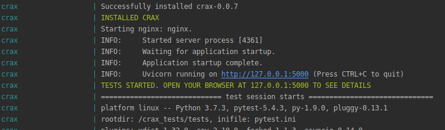
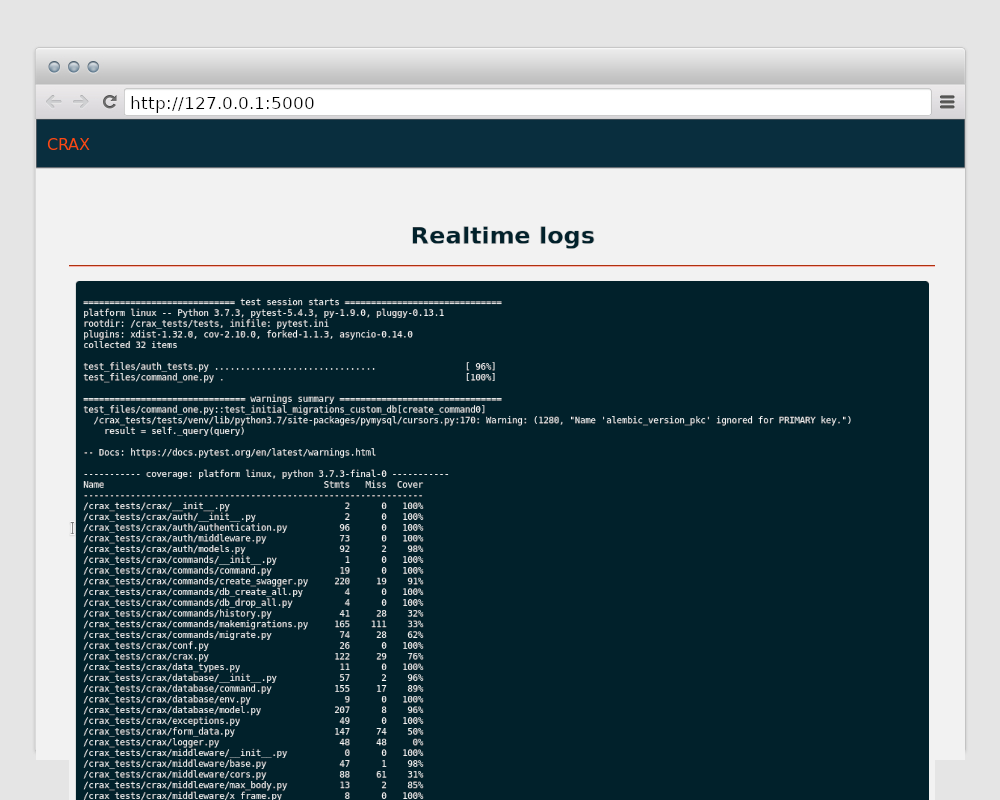
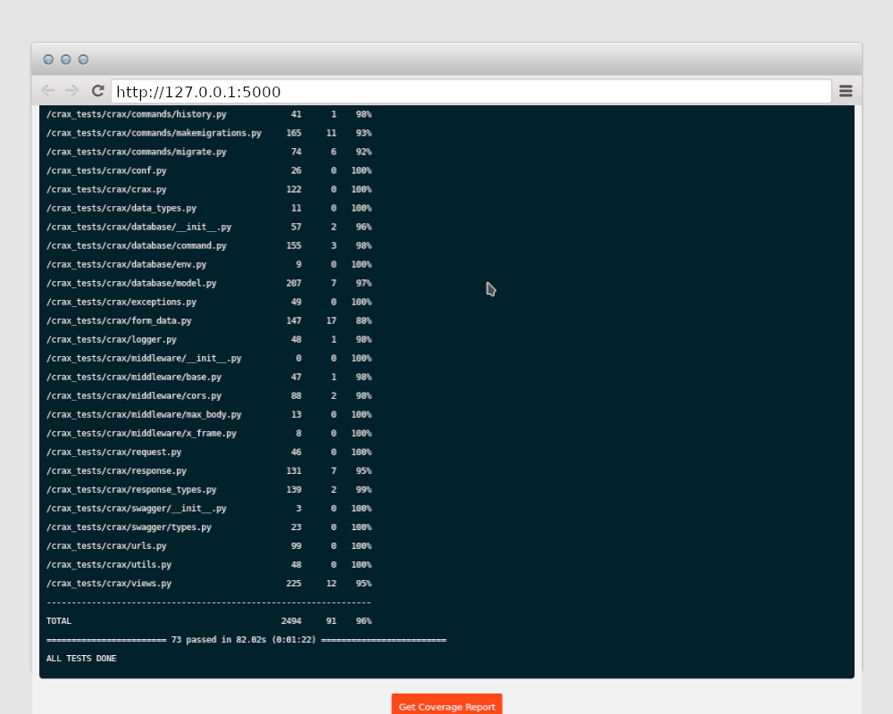
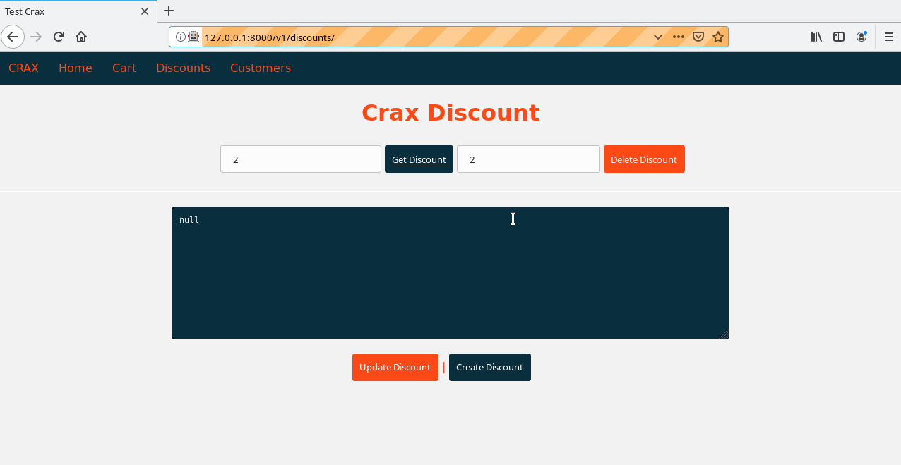

.. _testing:

Testing
-----------------------------------------------

Crax sources are covered in tests at about 96 percent out of 100.

.. image:: https://travis-ci.com/ephmann/crax.svg?token=77rRpJTVc37P9Fv9ndoW&branch=master
   :width: 80
   :target: https://github.com/ephmann/crax

.. image:: https://codecov.io/gh/ephmann/crax/branch/master/graph/badge.svg?token=NZGB6L5225
   :width: 100
   :target: https://github.com/ephmann/crax

As you may recall, Crax currently maintains three database backends and all tests have been run
against all backends. Crax uses `Travis CI <https://www.uvicorn.org/deployment/>`_ as a continuous integration system.
Also, all tests were carried out on development servers.
Thus, all tests were carried out with PostgreSQL 9.8, PostgreSQL 11, MySQL 8, MariaDB 10.3, SQLite 3.27.2.

Tests structure.
-----------------------------------------------
All tests are divided into parts for testing various Crax components.

The launch_tests.sh script is the entry point for running tests. This is a simple bash script
a file that runs tests one by one. Crax must be able to work with several
database backends such as `MySQL`, `PostgreSQL` and `SQLite`. Thus, all tests must run
against all backends listed above. The launcher runs test files in the correct order for every the
database backend. The launcher stops and exits with an error code if errors are encountered at any stage.
Which means `correct order`: First, you need to check everything that depends on the database.
Tests written to validate commands are combined to prepare for the next steps. For example `command_two.py` runs tests
and prepares files for `command_three.py`. All sources for this kind of tests are located in
directories `app_ *`. All test files that will be launched with `launch_tests.sh` are stored in `test_files`
directory. All `command_?.py` files will be run first. Next step is to test `Authentication` against
all of the databases. And finally will be ran common tests that are database independent.
Why is that? It's about the ability to work without a database backend
at all. Any Crax application can be built without a database, models or authentication etc.

**Directories**:

    **Config files**
        All configuration files for all test applications.

    **Test app auth**
        All sources for testing the Authentication backend.

    **Test app common**
        All sources for testing the database independent parts.

    **Test app nested**
        All sources for testing url resolving, namespaces and nested applications.

    **Test files**
        All pytest files.

    **App one - six**
       All sources for testing databases, cli tools (migrations, etc.).

    **Test selenium**
        Tests that are written using `Selenium <https://www.selenium.dev/>`_

    **Docker**
        All sources to run tests in Docker.

Run Tests (Ninja way).
-----------------------------------------------
If you want to run tests in the same way as they were run on development servers or in Travis CI, you
you need to install two databases.

PostgreSQL server and MySQL (or MariaDB) must be installed and running on your system.
Then you must create a database named `test_crax` for both backends. The `crax` user (or role in the case of PostgreSQL)
must be created with the password `CraxPassword`. database access should be granted to the `crax` user. As far as you
took these steps, you can launch the tests. You don't need to prepare the `SQLite` backend - it's ready.

.. code-block:: bash

    bash launch_tests.sh

Of course, you can comment out this in the `launch_tests.sh` file and only run` SQLite`:

.. code-block:: bash

    #!/usr/bin/env bash
    pip install .
    cd tests
    LOG_FILE='test.log'

    function pyTestCrax() {
        pytest --cov=../crax --cov-config=.coveragerc test_files/command_one.py
        pytest --cov=../crax --cov-config=.coveragerc test_files/command_two.py
        python -m pytest --cov=../crax --cov-append --cov-config=.coveragerc test_files/command_three.py
        python -m pytest --cov=../crax --cov-append --cov-config=.coveragerc test_files/command_four.py test_files/auth_tests.py
    }

    function runTests() {
        rm -f ${LOG_FILE}
        touch ${LOG_FILE}
        pyTestCrax | tee ${LOG_FILE}
        ret=$(cat ${LOG_FILE} | grep 'FAILED')
        if [ "$ret" = "" ];
            then
                rm -f ${LOG_FILE}
                echo 'OK'
            else exit 1;
        fi
    }
    pip install sqlalchemy databases alembic aiosqlite asyncpg psycopg2-binary aiomysql pymysql==0.9.2
    echo 'SQLite tests started'
    export CRAX_TEST_MODE='sqlite'
    runTests

    # export CRAX_TEST_MODE='mysql'
    # echo 'MySQL tests started'
    # runTests

    # export CRAX_TEST_MODE='postgresql'
    # echo 'PostgreSQL tests started'
    # runTests

    pip uninstall --yes sqlalchemy databases alembic
    python -m pytest --cov=../crax --cov-append --cov-config=.coveragerc test_files/common_tests.py

Run Tests (Normal way).
-----------------------------------------------
It's okay if you don't want every possible database server installed on your system. Actually I don't have
database servers in my laptops (maybe so are you). But you want to run tests. The solution is to run all tests in Docker.
First of all, you must have Docker and Docker compose installed on your system.
Follow the link `Install Docker Compose <https://docs.docker.com/compose/install/>`_ for details.
Then move to `crax/docker` directory and run:

.. code-block:: bash

    bash docker_tests.sh

This method is surely available to all Linux and OS X users.
Since you ran `docker_tests.sh`, you should wait until the docker image is built. You should see something like
this

This means that you are ready to open your browser (or a couple of browsers) at `http://127.0.0.1:5000`
and see the test results in real time.
Sometimes you will probably need to refresh the page once, but basically the whole testing cycle will translate to
page without page refreshing.

After completing all tests, you may want to see the Coverage Report. So click the button at the bottom of the
page. After the first click button text will be changed, which means that the current report has been generated.
Click the button to go to Report pages.

It should be noted that Crax Docker tests were written with Crax. Streaming test results to the browser in real time
this is a Crax app. So you are testing Crax with Crax.

Run Tests (Selenium).
-----------------------------------------------
Some tests are written in Selenium. Created a simple SPA application with
`VueJs <https://vuejs.org/>`_ framework and several tests have been written for this application.
First you should install python selenium package.

.. code-block:: bash

    pip install selenium

Then you will need installed `Gecko driver`. You can use predefined bash script from Crax.

.. code-block:: bash

    bash install_gecko.sh

Available options:
    **-a, --arch**:
        You OS Architecture. Default is 64. Can be set to 32.

    **-v, --version**:
        Driver version. If you are having trouble running tests due to WebDriver it might be
        because the unsupported version on your system. Default is 0.27.0

    **-d, --dir**:
        Specify the path where the driver should be installed.

.. code-block:: bash

     bash install_gecko.sh -a=64 --dir=$HOME -v=0.24.0

Once you have installed `Gecko driver`, you are able to launch selenium tests.

.. code-block:: bash

    bash run_selenium.sh

Available options:
    **-e, --executable**:
        Path to your installed `Gecko driver`.

    **-t, --threads**
        The number of browser instances and test processes that will be ran at the same time.  Default is 1.

    **-d, --delay**
        Time in seconds. Delay between selenium actions. Default is 2.

.. code-block:: bash

    bash run_selenium.sh -e=$HOME/ -t=3

So now you know about Crax testing. And that was the last chapter of the documentation.

Happy coding.

.. toctree::
   :maxdepth: 3
   :caption: Contents:

.. index::
   Testing